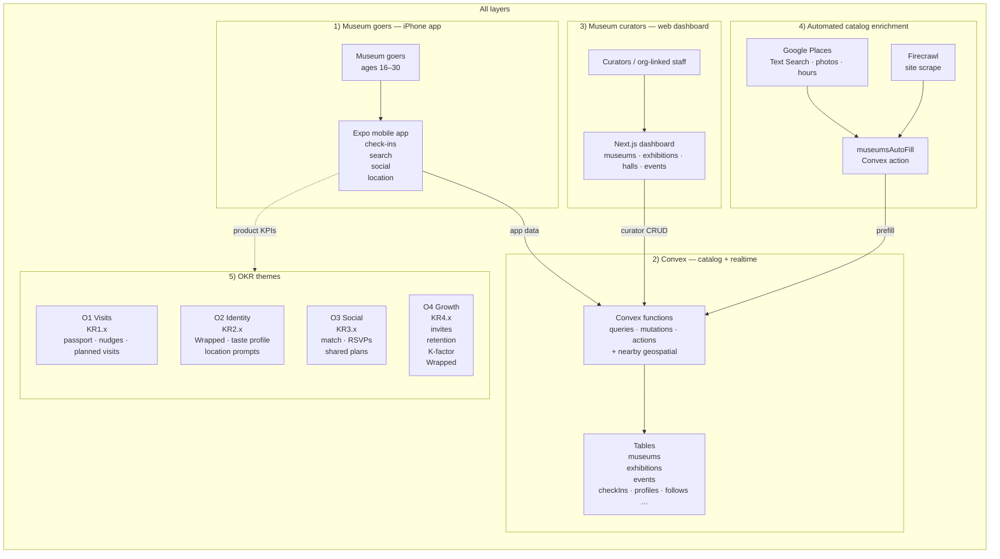
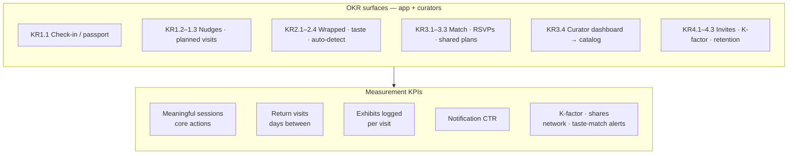

# Museum&

Welcome to the main repository for Museum&. For more information, visit our [wiki](https://github.com/cs210/AAM-1/wiki).

## Basics

Our main application is built with Next.js, Expo, and Convex. We use Turbo to manage the monorepo and pnpm to manage the dependencies.

```
pnpm install
pnpm dev
```

## Product architecture

High-level interfaces: museum goers use the **Expo (iPhone) app**; **curators** use the **Next.js web dashboard**; both talk to **Convex** (shared museum catalog). Museum coordinates are indexed for **nearby** recommendations via the Convex **geospatial** component (same backend as catalog queries — not a separate product surface).

**Google Places** and **Firecrawl** power automated museum catalog enrichment via Convex actions (`museumsAutoFill`).



### OKR score key

| Score | Meaning |
| --- | --- |
| 0 | Not Started |
| 0.3 | To Be Determined |
| 0.5 | On Track |
| 0.7 | Delivered |
| 1.0 | Beyond Expectations |

### Curator catalog inputs (events, times, location)

Curators use the **dashboard** to add and maintain **museums**, **exhibitions**, **halls**, and **events** — including **titles, descriptions, dates, and location** (museum-linked or independent), which flow into the same **Convex** tables the mobile app reads.

### OKR and KPI coverage (reference)



Repo touchpoints:

- Mobile: `apps/mobile/`
- Curator UI: `apps/web/` (e.g. `components/dashboard/`)
- Catalog + auto-fill: `packages/backend/convex/` — `museums.ts`, `exhibitions.ts`, `events.ts`, `museumsAutoFill.ts`

## Envrionment Variables

Please set the following environment variables in your environment. You can do this by creating a `.env.local` file in each of the apps and packages.

### Web

```bash
CONVEX_DEPLOYMENT=dev:wooden-hummingbird-900 # team: yami, project: yami

NEXT_PUBLIC_CONVEX_URL=https://wooden-hummingbird-900.convex.cloud

NEXT_PUBLIC_CONVEX_SITE_URL=https://wooden-hummingbird-900.convex.site
```

### Mobile

```bash
CONVEX_DEPLOYMENT=dev:wooden-hummingbird-900 # team: yami, project: yami

EXPO_PUBLIC_CONVEX_URL=https://wooden-hummingbird-900.convex.cloud

EXPO_PUBLIC_CONVEX_SITE_URL=https://wooden-hummingbird-900.convex.site
```

### Backend

Ensure that these environment variables are set based on your convex deployment.
```bash
CONVEX_DEPLOYMENT=dev:wooden-hummingbird-900 # team: yami, project: yami
CONVEX_URL=https://wooden-hummingbird-900.convex.cloud
CONVEX_SITE_URL=https://wooden-hummingbird-900.convex.site
```
Add the secret key and site URL to the backend environment variables within `./packages/backend/`:
```bash
npx convex env set BETTER_AUTH_SECRET=$(openssl rand -base64 32)
npx convex env set SITE_URL http://localhost:3000
```

For Better Auth and transactional emails (Resend), set:

```bash
npx convex env set RESEND_API_KEY re_your_api_key_here
npx convex env set RESEND_FROM_EMAIL "Museum& <onboarding@your-verified-domain.com>"
```

Use a [Resend API key](https://resend.com/api-keys) and a verified domain for `RESEND_FROM_EMAIL`. For testing you can use `onboarding@resend.dev` (default if `RESEND_FROM_EMAIL` is unset).

For museum info and exhibition auto-fill (Google Places + Firecrawl scraping), set:

```bash
npx convex env set GOOGLE_PLACES_API_KEY your_google_places_api_key
npx convex env set FIRECRAWL_API_KEY fc-your-firecrawl-api-key
```

Google setup notes:
- Create an API key in Google Cloud and enable the **Places API (New)**.
- The auto-fill flow uses **Text Search** and **Place Photos** endpoints.

Firecrawl setup notes:
- Create a Firecrawl API key from your Firecrawl dashboard.
- `FIRECRAWL_API_URL` is optional unless you are using a custom/self-hosted endpoint.

For museum visual search (RunPod), set:

```bash
npx convex env set RUNPOD_API_KEY your_runpod_api_key
```

RunPod set up notes:
- Create an API key in your settings.
- Set a serverless/pod template with a working version of tsekai/museum-search on DockerHub.
  - Set start command as ```bash -lc "rm -rf /app/museum-search && git clone https://github.com/t-sekai/museum-search.git && cd /app/museum-search && uvicorn app:app --host 0.0.0.0 --port 8000"```
  - Expose HTTP port 8000 and set env var ```PORT=8000```.
- Start your serverless/pod. You can then obtain the endpoint URL, updatable in the web admin panel.

This secret does not live on your machine, it is managed by Convex.
